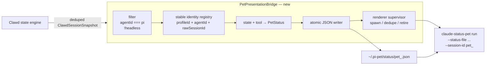

# Clawd × claude-status-pet 架构核查与 Bridge 契约

> 核查日期：当前 shallow clone。本文只描述代码中已确认的行为与建议的衔接方式。

## 结论

1. **Clawd 已经有完整的多 agent / 多 session 状态基础设施，也已包含 Pi connector、Remote SSH 与 session snapshot。**
2. **Clawd 没有供外部进程消费 session snapshot 的公共 HTTP / WebSocket API。**
   - `POST /state` 是 hooks 的**入站**接口。
   - `GET /state` 是 health response，不返回 sessions。
   - Dashboard/HUD 的 snapshot 是受信任 Electron renderer 专用 IPC，不可供独立 Tauri 应用连接。
3. Clawd 已有一个集中的 **in-process snapshot fan-out seam**：
   `state.js → ctx.broadcastSessionSnapshot(snapshot)`。
   这是 Phase 1 Bridge 的正确接入点。
4. **claude-status-pet 原生就是一 session 一桌宠窗口。** 显式模式支持：
   `claude-status-pet run --status-file <任意路径> --session-id <稳定ID>`。
   它只监听 JSON 文件，不关心状态来自哪种 agent。
5. 因此 MVP 不应重建 Clawd 的 registry，也不应从 `/state` 原始事件重建状态；应在 Clawd 状态机完成生命周期、去重、远程身份、stale cleanup 后，把 snapshot 投影给 status-pet。

---

## 1. Clawd-on-desk：现状架构

```mermaid
flowchart LR
  subgraph Sources[Agent sources]
    PI[Pi session]
    CC[Claude/Codex/...]
    REMOTE[Remote agent]
  end

  PI --> PIE[Pi extension\nhooks/pi-extension-core.js]
  CC --> HOOKS[Agent-specific hooks / monitors]
  REMOTE --> SSH[Remote SSH ingress]

  PIE -->|POST /state\nagent_id, session_id, event, state, tool_name| HTTP
  HOOKS --> HTTP
  SSH --> HTTP

  subgraph Clawd[Clawd main process]
    HTTP[server.js + server-route-state.js\nnormalize identity / remote profile]
    STATE[state.js\nsessions: Map<session_id, Session>\npriority, dedupe, stale cleanup]
    SNAP[state-session-snapshot.js\nbuildSessionSnapshot + signature dedupe]
    FANOUT[ctx.broadcastSessionSnapshot(snapshot)]

    HTTP --> STATE --> SNAP --> FANOUT

    FANOUT --> DASH[Dashboard IPC]
    FANOUT --> HUD[Session HUD IPC]
    FANOUT --> NOTIFY[Telegram / Slack / Discord / LAN]
    STATE --> AGG[resolveDisplayState()\nhighest-priority aggregate]
    AGG --> SINGLE[Clawd's single pet renderer\n1 render window + 1 hit window]
  end

  FANOUT -. recommended new consumer .-> BRIDGE[PetPresentationBridge]
```

### Clawd 的单宠物限制

Clawd 的 `sessions` Map 确实按 `session_id` 独立跟踪，但它的既有桌宠渲染是聚合的：

- `resolveDisplayState()` 选择所有 session 中优先级最高的 state。
- 主题文档说明 working 子动画按并发量表达：`1 session → typing`、`2 → headphones groove`、`3+ → building`。
- `pet-window-runtime.js` 只创建一组桌宠窗口：渲染窗 `renderWin` 与输入窗 `hitWin`。

所以 Clawd 适合作为本项目的 **session infrastructure**，但不适合作为“一个 top-level session 一只独立桌宠”的 presentation renderer。

### Pi 的已存在接入

`agents/pi.js` 已存在，并使用 Pi extension 推送生命周期事件：

| Pi / Clawd lifecycle | Clawd state |
|---|---|
| `SessionStart` | `idle` |
| `UserPromptSubmit` | `thinking` |
| `PreToolUse`, `PostToolUse` | `working` |
| `PostToolUseFailure` | `error` |
| `Stop` | `attention` |
| `SessionEnd` | `sleeping` |

`hooks/pi-extension-core.js` 当前还会发送 `tool_name` 与 `tool_use_id`，但**不会发送文件名、命令或其他 tool input**。

---

## 2. claude-status-pet：现状架构

```mermaid
flowchart LR
  AGENT[Claude / Copilot hook] --> WRITER[claude-status-pet write-status\nadapter maps event + tool]
  WRITER --> FILE[status-{session_id}.json]
  LAUNCHER[/pet on / launcher] --> GUI[claude-status-pet run\n--status-file ... --session-id ...]
  FILE --> WATCH[notify file watcher]
  WATCH --> GUI
  GUI --> UI[Tauri window + JS renderer\ncharacter / animation / drag]
```

本项目不会使用它的 Claude hooks 或 adapters，而是走已支持的显式窗口模式：

```bash
claude-status-pet run \
  --status-file "$HOME/.pi-pet/status/<safe-pet-id>.json" \
  --session-id "<safe-pet-id>" \
  --assets-dir "$HOME/.claude/pet-data/assets"
```

- 显式模式直接监听传入的状态文件路径；不要求文件在 `~/.claude/pet-data/` 下。
- `--session-id` 用于窗口锁；其值不能含 `/`、`\\` 或 `..`。
- 当前 lock 和默认 asset/config 目录仍为 `~/.claude/pet-data/`。MVP 可先复用；产品化时建议增加 `--data-dir` 或 `PI_PET_DATA_DIR`，摆脱 Claude 命名空间。
- `write-status` 不需要被 Bridge 调用；Bridge 直接写最终 JSON，避免其内置 Claude/Copilot event mapper 与默认目录限制。

### status-pet 输入契约

```json
{
  "state": "editing",
  "detail": "Editing pi-pet",
  "tool": "edit",
  "event": "PreToolUse",
  "session_id": "pet_4d03e01f...",
  "session_name": "local / Pi / pi-pet",
  "timestamp": "2026-09-01T00:00:00Z"
}
```

UI 实际读取字段：`state`、`detail`、`tool`、`event`、`session_id`、`session_name`。`timestamp` 可用于 Bridge 的恢复/清理策略。

可显示的状态：

```
idle | thinking | reading | editing | searching | running
| delegating | waiting | error | offline | closed
```

### 重要限制：角色不是 per-session 配置

status-pet 的角色选择当前是 `localStorage['petMode']`（`pet-app/src/app.js`），没有按 `session_id` 分区。

- **已经支持：** 一 session 一 Tauri 进程 / 一窗口 / 一状态文件。
- **尚不支持：** 稳定的 `sessionId → character/skin` 映射。

因此“每个 Pi session 有一只桌宠”可直接实现；“每个 session 固定不同形象”需要一个小的 frontend patch：把 `petMode` 等偏好改为 `petMode:<petSessionId>`，并让 Bridge 的 registry 或用户设置决定初始皮肤。

---

## 3. 推荐的衔接架构



### 为什么 Bridge 必须接在 snapshot fan-out 后

不要在外部监听或重放 `POST /state`：它会错过 / 重做以下 Clawd 已完成的工作：

- remote profile / host identity
- 进程恢复、dedupe、stale cleanup
- completion / permission hold 与状态优先级
- 非 HTTP 来源（log monitor、runtime cleanup、remote transport）造成的状态变化
- session alias、title、project label 等 metadata

正确数据路径是：Clawd 先产生权威 per-session snapshot，Bridge 再作 presentation projection。

---

## 4. 已存在的 Clawd Snapshot 接口

`state.js` 会调用：

```js
ctx.broadcastSessionSnapshot(snapshot)
```

主进程目前把它扇出给 Dashboard、Session HUD、通知与 LAN 消费者。它是已有的 observer seam，但**还不是对外 API**。

每项 `snapshot.sessions[]` 已有的关键字段：

```ts
type ClawdSessionSnapshotEntry = {
  id: string;
  profileId: string;             // local 或 remote profile
  rawSessionId: string;
  agentId: string;               // "pi", "claude-code", ...
  agentName: string;
  state: string;
  displayTitle: string;
  displayFolder: string;         // cwd 的展示项目名
  cwd: string;
  updatedAt: number;
  host: string | null;
  sourceType: "local" | "ssh" | "wsl";
  sourceLabel: string;
  sourceDisplayLabel: string;
  headless: boolean;
  lastEvent: { rawEvent: string | null; at: number } | null;
  assistantLastOutput: string | null;
};
```

### 当前缺口

1. **没有公开 HTTP/WebSocket session export**：外部进程不能安全订阅它。
2. **snapshot 未导出 `lastToolName`**：`state.js` 的内部 Session 已保存该字段，但 `state-session-snapshot.js` 未输出它。
3. **没有 sanitized activity detail**：Pi hook 只发工具名，因此无法凭空显示 `Editing state.ts` 或 `Running npm test`。

`lastToolName` 还应参与 `sessionSnapshotSignature()`，保证只变工具名的更新同样对 Bridge 可见。

---

## 5. 最小、低侵入的 Clawd 改动

不改 Pi connector、不改 SSH、不重写 state machine。只新增 presentation consumer：

1. 新建 `src/pet-presentation-bridge.js`。
2. 在 `main.js` 创建它，并在既有 `broadcastSessionSnapshot(snapshot)` 中调用：

   ```js
   petPresentationBridge.onSnapshot(snapshot);
   ```

3. 在 `buildSessionSnapshotEntry()` 增加已规范化的：

   ```js
   toolName: session.lastToolName || null
   ```

   同时加入 `sessionSnapshotSignature()`。
4. Bridge 将 `ClawdSessionSnapshotEntry` 转为项目自己的、harness 无关的 `PetSessionSnapshot`，再写 status-pet JSON。

### 建议的项目中间协议

```ts
type PetSessionSnapshot = {
  key: string;                   // stable opaque pet id
  source: {
    profileId: string;
    agent: string;
    rawSessionId: string;
    host: string | null;
    kind: "local" | "ssh" | "wsl";
  };
  label: string;                 // alias/title/project 的展示名
  project: string;
  state: "idle" | "thinking" | "reading" | "searching" |
         "editing" | "running" | "waiting" | "error" |
         "done" | "sleeping";
  tool: string | null;
  activity: string | null;       // 仅允许脱敏、长度受限的展示文本
  updatedAt: number;
  lifecycle: "live" | "ended";
};
```

### 稳定 identity

不要直接把 Clawd 的 `id` 用作文件名：Pi fallback 有可能来自 session file path，可能包含 `/`。

```text
identityInput = profileId + "\0" + agentId + "\0" + rawSessionId
petSessionId  = "pet_" + hex(sha256(identityInput)).slice(0, 24)
```

- hash 是 renderer / 文件 / lock 使用的稳定 opaque ID。
- `displayTitle`、`displayFolder`、`host` 仅用于 UI label，不参与 identity。
- remote 与 local 的相同 raw session ID 因 profileId 不同而不会冲突。

---

## 6. Clawd → status-pet 映射（MVP）

| Clawd session state | 额外条件 | status-pet state | 建议 detail |
|---|---|---|---|
| `idle`, `roam` | | `idle` | `Waiting for input` |
| `thinking`, `sweeping` | | `thinking` | `Thinking…` |
| `working` | tool 为 read/fetch/list | `reading` | `Reading <project>` |
| `working` | tool 为 grep/search/find/glob | `searching` | `Searching…` |
| `working` | tool 为 edit/write/create | `editing` | `Editing <project>` |
| `working` | tool 为 agent/task/skill | `delegating` | `Delegating…` |
| `working` | 其他 / 无 tool | `running` | `Running <tool>` |
| `notification` | permission / UI prompt | `waiting` | `Waiting for approval` |
| `attention` | `Stop` / completed turn | `idle` | `Done · waiting for input` |
| `error` | | `error` | `Something went wrong` |
| `sleeping` + `SessionEnd` | | `closed` | `Session ended` |
| `sleeping` / stale | 未确认结束 | `offline` | `Sleeping` |

MVP 可以显示 `Editing <project>`。如果要实现样例里的 `Editing state.ts` / `Running tests`，需在各 connector 产出一个**显式脱敏的** `activity` 字段（例如仅 basename 或截断命令摘要），而不是把原始 tool input 无限制写进状态文件。

---

## 7. 推荐实施顺序

1. **Fork Clawd**，只新增 Bridge module 与 `onSnapshot` consumer；保留原 Pi / SSH / state engine。
2. 为 snapshot 添加 `toolName`，先只支持 `agentId === "pi"`、`!headless`。
3. Bridge 建立 `identity → child process / status path / position / character` registry。
4. 使用 status-pet 的显式窗口模式启动每个 renderer，并原子写入 JSON。
5. SessionEnd：先写 `closed`，播放 retire/sleep；由 supervisor 在延迟后退出该 renderer、保留或清理状态文件。
6. 之后才做：可配置 data dir、per-session skin、generic agent filter、Remote SSH UI、subagent mini-pets。

### 最小 Bridge 的试运行配置

Bridge 默认关闭，避免影响原 Clawd。启动 Clawd 时提供下列环境变量：

```bash
CLAWD_PET_BRIDGE=1 \
CLAWD_PET_BRIDGE_STATUS_DIR="$HOME/.pi-pet/status" \
CLAWD_PET_BRIDGE_RENDERER_BIN="/absolute/path/to/claude-status-pet" \
CLAWD_PET_BRIDGE_ASSETS_DIR="$HOME/.claude/pet-data/assets" \
npm start
```

- 没有 `CLAWD_PET_BRIDGE_RENDERER_BIN` 时，Bridge 仍写 JSON，方便检查状态投影，但不会启动桌宠窗口。
- 设置 renderer binary 后，每个首次出现的 live Pi session 会启动一个 `claude-status-pet run --status-file … --session-id …` 子进程。

### 后续解耦选项（非 MVP）

如果未来不想维护 Clawd fork，可再为 Clawd 添加一个版本化、只绑定 loopback 且带随机 runtime token 的 `GET /v1/session-snapshot` + WebSocket/SSE export。当前 `GET /state` 不能复用，因为它是健康检查，不是状态协议。
